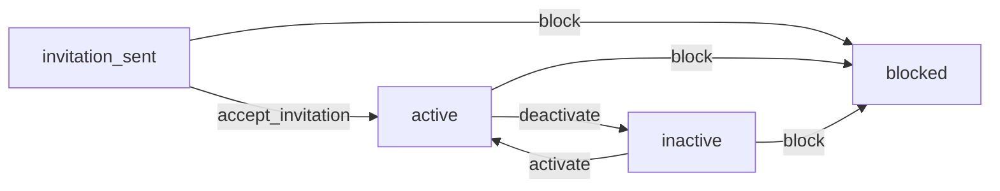

# js-state-machine


This is a simple, lightwight library for state machines for JavaScript, with full TypeScript support.

**Index:**

- [js-state-machine](#js-state-machine)
  - [How to install?](#how-to-install)
  - [How to use?](#how-to-use)
    - [Context](#context)
    - [Defining a state machine](#defining-a-state-machine)
    - [Asynchronous getter/setter](#asynchronous-gettersetter)
    - [Transition guards](#transition-guards)

## How to install?

```sh
npm install --save @shooktea/js-state-machine
```

## How to use?

### Context

Imagine that your application has a `User` entity. User can be invited, and after accepting invitation is marked as
`active`. That user can be then deactivate or activated again; and it can be irreversibly blocked from any state. The
flowchart of possible statuses and transitions looks like this:



and you store it in the user model, like this:

```typescript
type UserStatus = 
  | 'invitation_sent'
  | 'active'
  | 'inactive'
  | 'blocked'
  ;

interface User {
  id: string;
  status: UserStatus;
  name: string;
  // ...
}
```

Note that there is nothing preventing you from doing an "illegal" transition:

```typescript
const user: User = {
  status: 'active';
  // ...
};

user.status = 'invitation_sent';
```

State machine can help you with that, by defining a list of acceptable transitions.

> [!NOTE]
> This example is pretty simple: you change user status just by setting a new value. This library can also work with
> more advanced cases, such as using functions, including asynchronous ones. As long as there is a clear defined way of
> both accessing a current state and updating the state, this library will work.

### Defining a state machine

Here's the state machine created for our purposes:

```typescript
import stateMachine from '@shooktea/js-state-machine';

const userStateMachine = stateMachine({
  // A list of all allowed states:
  // (as const is needed for TypeScript to properly detect allowed options)
  states: ['invitation_sent', 'active', 'inactive', 'blocked'] as const,

  // An object with transitions. Each key is a name of a transition.
  transitions: {
    accept_invitation: {
      // "from" defines allowed state on which the transition can be applied. "to" defines the expected state after
      // applying the transition.
      // In this case, it means: "accept_invitation" changes state from "invitation_sent" to "active"
      from: 'invitation_sent',
      to: 'active',
    },
    activate: {
      from: 'inactive',
      to: 'active',
    },
    deactivate: {
      from: 'active',
      to: 'inactive',
    },
    block: {
      // Transition can have multiple "from" states. In this case, the "block" transition can be applied on users
      // with any of those three states. 
      from: ['invitation_sent', 'active', 'inactive'],
      // Each transition can have only one ending state - there's not much sense in having a transition going to
      // multiple states at the same time.
      to: 'blocked',
    }
  },

  // A function that reads a current state from the user
  getState: (user: User) => user.status,

  // A function that updates a user with a new state
  setState: (user: User, newStatus: UserStatus) => {
    user.status = newStatus;
  }
});
```

Now you can use two methods of the created state machine, `can()` and `apply()`. They both expect a name of a transition
and a user object.

`can()` will return either `true` or `false`, depending on whether the transition is allowed or not:

```typescript
const user: User = {
  status: 'active';
  // ...
}

userStateMachine.can('deactivate', user); // returns `true`
userStateMachine.can('accept_invitation', user); // returns `false`
```

`apply()` will attempt to actually do the transition. If the transition is not allowed, it will throw an error.

```typescript
const user: User = {
  status: 'active';
  // ...
}

userStateMachine.apply('deactivate', user);
console.log(user.status); // "inactive"

try {
  userStateMachine.apply('deactivate', user);
} catch (error) {
  console.log(error.message);
  // Transition deactivate can only be applied from state active; current state is inactive
}
```

### Asynchronous getter/setter

If both `getState` and `setState` passed when creating the state machine are fully synchronous, `apply` and `can`
methods will be synchronous too, returning `void` and `boolean` respectively.

You can define `getState` or `setState` to be asynchronous as well.

- `can()` will return `Promise<boolean>` if `getState` returns `Promise`
- `apply()` will return `Promise<void>` if either `getState` or `setState` returns a `Promise`

```typescript
const userStateMachine = stateMachine({
  states: [
    // ...
  ],
  transitions: {
    // ...
  },

  // Example async getter/setter functions:
  getState: async (user: User) => {
    return await getUserStatus(user);
  },
  setState: async (user: User, newStatus: UserStatus) => {
    await setUserStatus(user, newStatus);
  }
});


const user: User = {
  status: 'active';
  // ...
}

userStateMachine.can('deactivate', user).then(
  (canActivate: boolean) => {
    // ... handle the resulting Promise with callback
  }
)

// Or with an await:
await userStateMachine.apply('deactivate', user);
```

### Transition guards

The examples up to this point were pretty straightforward - you can apply a transition if the current status of a user
is accepted by the transition. There might be need of adding additionalchecks that verify if given transition is
acceptable. For example, you may want to forbid accepting invitations when the invitation was sent more than a week ago.

For such purposes, you can define transition guards.

> [!CAUTION]
> Because guards can be asynchronous, if you pass a `guards` property, both `apply()` and `can()` methods will always
> be asynchronous - even if defined `getState()` and `setState()` are working synchronously.

You can define guards:

- for all transitions
- for selected transitions
- for transitions entering a chosen state
- for transitions leaving a chosen state

Each guard is a function that receives an object with context of the transition - entity (in our example that's a `User`
object), transition name, name of the current state of the entity and the target state of the entity. The expected
return value of such guard is either a `void` or `null`, if the transition is allowed, or a `string` with error message
if the transition is not allowed. Because guards can by asynchronous, returning `Promise<void|null|string>` is also
handled properly.

Guards are called when running both `apply()` and `can()`. If the guard returns a `string` with an error message, `can()`
will return `false`, while `apply()` will throw an `Error`.

> [!NOTE]
> If guard throws an `Error`, it will be thrown by both `apply()` and `can()`.

```typescript
const userStateMachine = stateMachine({
  states: ['invitation_sent', 'active', 'inactive', 'blocked'] as const,
  transitions: {
    accept_invitation: {
      from: 'invitation_sent',
      to: 'active',
    },
    activate: {
      from: 'inactive',
      to: 'active',
    },
    deactivate: {
      from: 'active',
      to: 'inactive',
    },
    block: {
      from: ['invitation_sent', 'active', 'inactive'],
      to: 'blocked',
    }
  },
  getState: (user: User) => user.status,
  setState: (user: User, newStatus: UserStatus) => {
    user.status = newStatus;
  },

  guards: {
    // guards.all are executed for all transitions
    all: [
      (context) => {
        const { entity, transition, from, to } = context;
        // entity - the User object passed when running a transition
        // transiton - the name of a transition
        // from - the current state of the user
        // to - the expected state of the user after the transition is complete
      },
      // Because it's an array, you can pass multiple guard functions
      () => { /* ... */ },
      // They can also be async
      async () => { /* ... */ },
    ],

    // guards.transitions are executed only when a defined transition is called:
    transitions: {
      accept_invitation: [
        ({ user }) => {
          const maxInvitationAge = 1000 * 60 * 60 * 24 * 7; // 7 days
          if (user.invited_at < Date.now() - maxInvitationAge) {
            return 'Invitation expired';
          }
        }
      ],
    },

    // guards.fromState are executed only on transitions leaving a given state. For example:
    fromState: {
      active: [
        // Guards defined here will be called when transition moves user from state "active" to any other state.
      ],
    },

    // guards.toState are executed only on transition entering a given state. For example:
    toState: {
      active: [
        // Guards defined here will be called when transition moves user from any initial state to "active".
      ],
    },
  },
});

const user: User = {
  status: 'invitation_sent',
  invited_at: // long time ago
}

await userStateMachine.can('accept_invitation', user); // will return "false"
await userStateMachine.apply('accept_invitation', user); // will throw an Error with message "Invitation expired"
```

Note: Guards are called only after determining that a given transition is valid. For the example above, the guard
defined for `accept_invitation` transition is called because that transition accepts users with status
`invitation_sent`. If user had any other status that is not permitted by `accept_invitation` transition, then
`userStateMachine.can()` will return `false` without running guards.

Guards are run in a following order:

1. `guards.all`
2. `guards.transitions`
3. `guards.fromState`
4. `guards.toState`

and they're stopped at first reported error. That means that if a guard in `guards.all` has reported an error, guards
from `guards.transitions` will not be called.
